# 🚲RideWay

> Rideway는 자전거가 취미인 사람들의 커뮤니티를 위한 웹 및 어플리케이션입니다. 주요 기획 의도는 **자전거를 타는 사람들이 쉽고 간편하게 소통하고, 기존의 주행 기록을 남겨주는 앱들에 대한 불편점을 개선하고 통합하기 위한 서비스**의 개발이였습니다.  
> 평소에도 라이딩을 하며 국토 종주를 하면서 겪었던 다양한 경험들에 대한 불편한 점을 해소하기 위해 개발되었고 사용자들의 경험을 간편하게 공유할 수 있으며 다른 사람들과의 만남을 이끌어 낼 수 있는 서비스를 제공하고자 하였습니다.


# 서비스

## 0. 메인 페이지


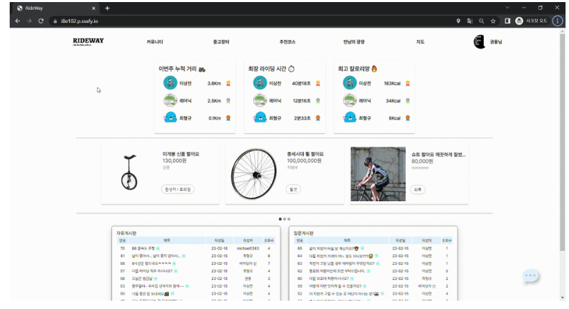

## 1. 커뮤니티 기능


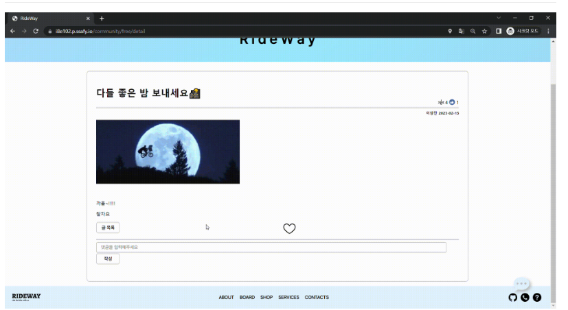


## 2. 중고 거래 기능

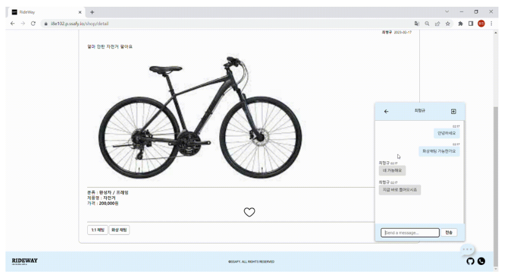


## 3. 모임 기능


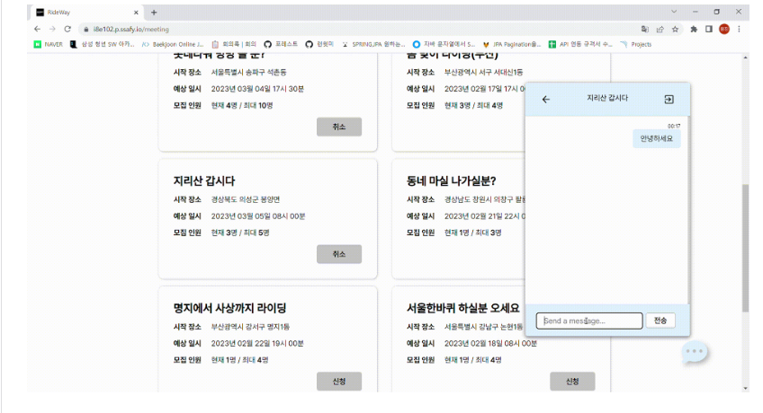


## 4. 지도 기능


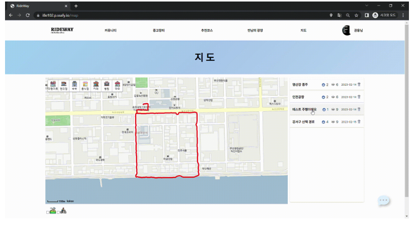


## 5. 앱 기능


#### 메인화면
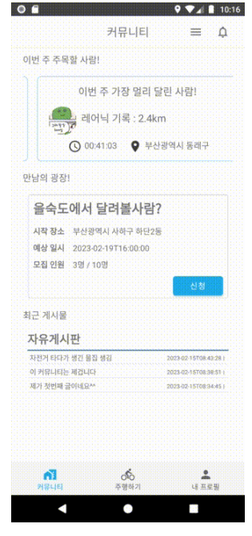


#### 지도 및 경로
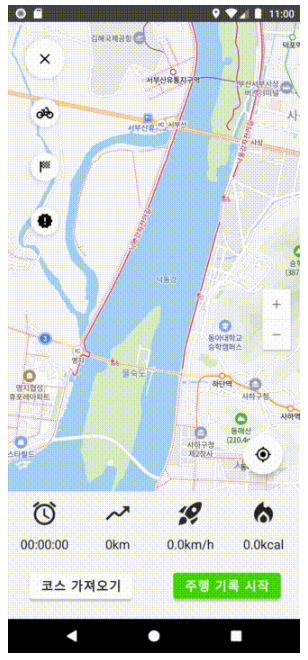


### 서비스 전체 기능

- 커뮤니티 기능 - 자유게시판, 질문게시판, 인증게시판, 정보 게시판으로 각각의 분야별로 커뮤니티 이용 가능
  - 좋아요, 댓글
- 중고 거래 기능 - 중고 상품들을 거래 가능, 판매자의 이전 판매 기록 열람 가능
  - 화상 채팅 - 판매자와 실시간으로 얼굴을 보면서 소통 가능
  - 찜하기
- 모임 기능 - 같이 라이딩을 하고 싶은 사람들을 모을 때 사용할 수 있음
- 채팅 기능 - 다른 유저들과 채팅으로 소통할 수 있음
- 지도 기능 - 병원, 카페 등의 주변정보나 자전거 전용 도로, 지형 등에 대한 정보를 볼 수 있음
- 주행 기록 저장 기능 - 자전거를 탄 주행 기록과 경로를 저장하고 확인 할 수 있음
- 경로 추천 기능 - 서로의 주행 경로를 공유할 수 있음 
 - 좋아요
 - 경로 저장 - 마음에 드는 경로를 저장해두면 이후에 지도에서 목록을 통해 확인할 수 있음
- 랭킹 기능 - 전체에서, 혹은 주별로 특별한 기록을 세운 사람은 메인 화면에 게시됨
- 업적 기능 - 업적 달성 시 뱃지를 지급


# 📝 Design


## 🛠️ 기술 스택
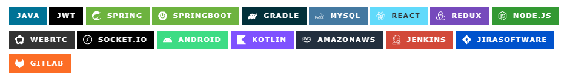


## 🖥 시스템 아키텍처

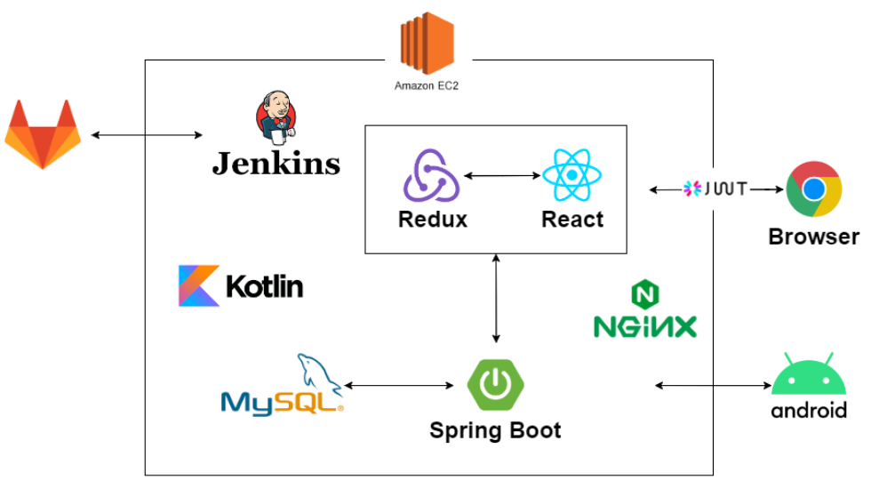


## 🗂️ 디렉토리 구조

#### BE
```
📦demo-1
 ┣ 📂GPXDIR
 ┣ 📂gradle
 ┃ ┗ 📂wrapper
 ┣ 📂images
 ┃ ┣ 📂board
 ┃ ┣ 📂deal
 ┃ ┗ 📂profile
 ┣ 📂logs
 ┣ 📂src
 ┃ ┣ 📂main
 ┃ ┃ ┣ 📂gpx
 ┃ ┃ ┣ 📂java
 ┃ ┃ ┃ ┗ 📂com
 ┃ ┃ ┃   ┗ 📂example
 ┃ ┃ ┃     ┗ 📂demo
 ┃ ┃ ┃       ┣ 📂config
 ┃ ┃ ┃       ┣ 📂controller
 ┃ ┃ ┃       ┣ 📂domain
 ┃ ┃ ┃       ┣ 📂mapping
 ┃ ┃ ┃       ┣ 📂repository
 ┃ ┃ ┃       ┗ 📂service
 ┃ ┃ ┣ 📂resources
 ┃ ┃ ┗ 📂webapp
 ┃ ┃   ┗ 📂WEB-INF
 ┃ ┃     ┗ 📂views
 ┃ ┗ 📂test
 ┃   ┗ 📂java
 ┃     ┗ 📂com
 ┃       ┗ 📂example
 ┃         ┗ 📂demo
 ┗ 📂Unofficial
```


#### FE
```
 ┣ 📂public
 ┃ ┣ 📂images
 ┗ 📂src
   ┣ 📂assets
   ┃ ┣ 📂fonts
   ┃ ┃ ┗ 📂woff
   ┃ ┗ 📂images
   ┣ 📂components
   ┃ ┣ 📂Address
   ┃ ┣ 📂chat
   ┃ ┣ 📂commons
   ┃ ┃ ┣ 📂carousel
   ┃ ┃ ┗ 📂datePicker
   ┃ ┣ 📂Community
   ┃ ┣ 📂Course
   ┃ ┣ 📂Error
   ┃ ┣ 📂Footer
   ┃ ┣ 📂Layout
   ┃ ┣ 📂MeetingList
   ┃ ┣ 📂MeetingRegister
   ┃ ┣ 📂MyCalendar
   ┃ ┣ 📂Navbar
   ┃ ┣ 📂Pagination
   ┃ ┣ 📂ProfileImage
   ┃ ┣ 📂Shop
   ┃ ┣ 📂Timer
   ┃ ┣ 📂UserDropDown
   ┃ ┣ 📂UserHealth
   ┃ ┣ 📂UserImage
   ┃ ┣ 📂UserInfo
   ┃ ┣ 📂User_Activity
   ┃ ┗ 📂User_Navbar
   ┣ 📂pages
   ┃ ┣ 📂Community
   ┃ ┣ 📂Course
   ┃ ┣ 📂EditUser
   ┃ ┣ 📂Login
   ┃ ┣ 📂Main
   ┃ ┣ 📂Map
   ┃ ┣ 📂MeetingPage
   ┃ ┣ 📂MyPage
   ┃ ┣ 📂Shop
   ┃ ┣ 📂Signup
   ┃ ┣ 📂tmp_chat
   ┃ ┣ 📂UserInfo
   ┃ ┣ 📂UserSearch
   ┃ ┗ 📂Video
   ┣ 📂router
   ┣ 📂store
   ┃ ┣ 📂apis
   ┃ ┣ 📂modules
   ┃ ┗ 📂sagas
   ┣ 📂Style
   ┗ 📂utils
```


#### App
```
📦src
 ┣ 📂androidTest
 ┃ ┗ 📂java
 ┃   ┗ 📂com
 ┃     ┗ 📂android
 ┃       ┗ 📂rideway_app
 ┣ 📂main
 ┃ ┣ 📂assets
 ┃ ┣ 📂java
 ┃ ┃ ┗ 📂com
 ┃ ┃   ┗ 📂android
 ┃ ┃     ┗ 📂rideway_app
 ┃ ┃       ┣ 📂chat
 ┃ ┃       ┣ 📂community
 ┃ ┃       ┣ 📂deal
 ┃ ┃       ┣ 📂login
 ┃ ┃       ┣ 📂mainapp
 ┃ ┃       ┣ 📂map
 ┃ ┃       ┣ 📂meeting
 ┃ ┃       ┣ 📂Mypage
 ┃ ┃       ┣ 📂retrofit
 ┃ ┃       ┃ ┣ 📂chat
 ┃ ┃       ┃ ┣ 📂community
 ┃ ┃       ┃ ┣ 📂deal
 ┃ ┃       ┃ ┣ 📂fileUpload
 ┃ ┃       ┃ ┣ 📂login
 ┃ ┃       ┃ ┣ 📂meeting
 ┃ ┃       ┃ ┣ 📂myProfile
 ┃ ┃       ┃ ┣ 📂region
 ┃ ┃       ┃ ┗ 📂weeklyUser
 ┃ ┃       ┗ 📂service
 ┃ ┗ 📂res
 ┃   ┣ 📂anim
 ┃   ┣ 📂drawable
 ┃   ┣ 📂drawable-v24
 ┃   ┣ 📂font
 ┃   ┣ 📂layout
 ┃   ┣ 📂menu
 ┃   ┣ 📂mipmap-anydpi-v26
 ┃   ┣ 📂mipmap-hdpi
 ┃   ┣ 📂mipmap-mdpi
 ┃   ┣ 📂mipmap-xhdpi
 ┃   ┣ 📂mipmap-xxhdpi
 ┃   ┣ 📂mipmap-xxxhdpi
 ┃   ┣ 📂values
 ┃   ┣ 📂values-night
 ┃   ┗ 📂xml
 ┗ 📂test
   ┗ 📂java
     ┗ 📂com
       ┗ 📂android
         ┗ 📂rideway_app

```

## 💾 ERD 다이어그램
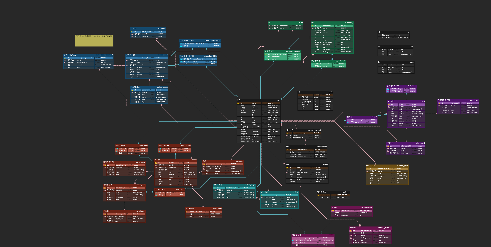


---

### 🔖Convention

---

#### 1. Git commit message

- type

  - Feat: 기능 추가
  - Fix: 버그 수정
  - Update: 코드 수정
  - Docs: ReadMe 및 문서 변경
  - Style: 띄어쓰기, 세미콜론 수정 등
  - Chore: 라이브러리, gradle 버전 맞추기
  - Refactor: 코드 최적화
  - Remove: 파일 제거
  - ADD:  파일 추가

- Subject

  - 50자를 넘기지 말 것

  - 한글로 작성하고, 마침표 쓰지 않을 것


```
예시) [파트] ADD: 파일작업 내용
담당 파트: FE, BE, AOS, DP
```

- **GitLab branch 전략**
  - master : 제품으로 출시될 수 있는 브렌치. 최선의 상태 유지
  - develop : 개발과정에서 Front-End / Back-End의 코드를 모아 빌드하여 테스트 하는 브렌치
  - feature: 해당 기능 구현을 진행할 때 사용하는 브렌치
- **Jira**
  - 이슈생성
    - 월요일에 주 단위 스프린트 이슈들을 생성
    - 각자의 역량에 맞는 이슈 분배
  - 이슈 완료
    - 하나의 티켓은 되도록 하나의 커밋으로 처리
  - 이슈 진행
    - 3시간 이상 해결되지 않을 시 팀원 도움 요청하기
    - 맡은 일은 최선을 다해서 끝내기

---

### 📃기록

- 1일 1회의 이상 진행 후 회의록을 `Notion`에 남긴다.
  - https://clumsy-pleasure-947.notion.site/d0b19ac938b444f4a7605d83ac6be1de?v=2858af2735574a35bbcd364282340e8c

- 오전에 스크럼 회의 진행
  - 이전 작업에서 했던 일, 오늘 할 일, 에러 사항 등을 아주 빠른 시간에 공유 및 리뷰
  - https://www.notion.so/9386789923b5465594b4581e576233ed?v=fa2185d73ead47bface50c965a593ad4


---

### ✏기획 / 설계

| 구분              | URL                                                          |
| ----------------- | ------------------------------------------------------------ |
| 기획서            | 파일 형태 업로드                                             |
| 피그마            | [https://www.figma.com/file/Cf7yApPwwkLJZm1P6j3WJd/%EA%B3%B5%ED%86%B5-PJT?node-id=0%3A1&t=W3h0lHUX6v98ImnN-0](https://www.figma.com/file/Cf7yApPwwkLJZm1P6j3WJd/공통-PJT?node-id=0%3A1&t=W3h0lHUX6v98ImnN-0) |
| API 연동 규격서   | https://docs.google.com/spreadsheets/d/1viIlJ_Aqn48uAJmR1TGB4Cv9LCA2cnBmUL_EiaFsqb0/edit#gid=0 |
| ERD               | https://www.erdcloud.com/d/nHAH8dqehkava3uwB                 |
| 기능명세서        | https://docs.google.com/spreadsheets/d/1G2wQvuCCU6PUzvZS7AmbfDqdYM8gr-DHa5T08NMJoR4/edit#gid=0 |
| GanttChart        | PNG 형식 모음                                                |
| 시퀀스 다이어그램 | PNG 형식 모음                                                |
| TestCode          | 시간 부족으로 미진행                                         |
| 플립 예약         | https://docs.google.com/spreadsheets/d/1G9ZGNzhl6b47aHJ42SWS3agR0LM5WPg-7e68Z-Tx6Dk/edit#gid=759164879 |


---


### 🗃역할


| 팀원명 | 담당 포지션 |         |
| ------ | ----------- | ------- |
| 이상찬 | FE          | 웹      |
| 윤도현 | BE          | 웹      |
| 최형규 | FE          | 웹      |
| 하상재 | FE          | 앱      |
| 서우린 | BE          | 앱 + 웹 |
| 권용진 | BE          | 웹      |

---

### 📅일정

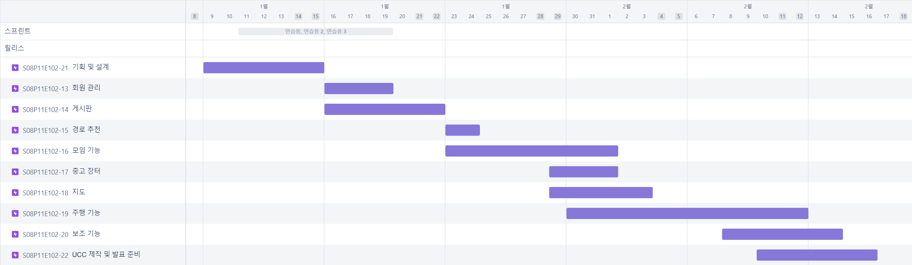
