### 🛠 프로젝트 기술 스택

- 앱, 웹 개발 모두 진행
  - 주요 기술 스택: `Kotlin`, `Spring`, `React`

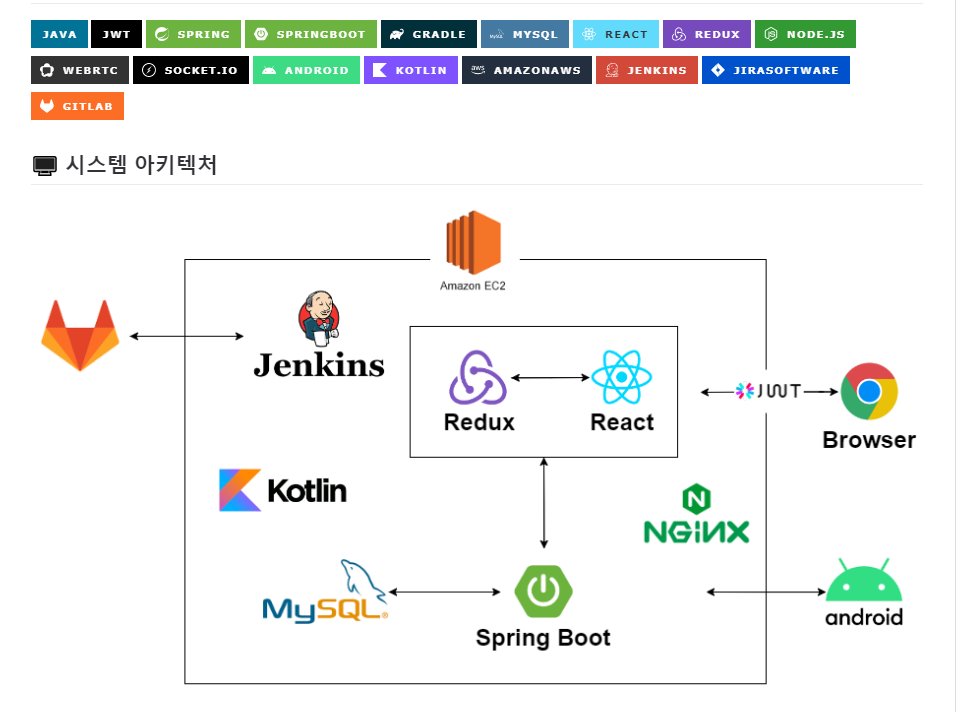

---

### 💡 배포 사항

- 젠킨스를 활용한 자동 배포 진행
- 버전 정보

```
// 안드로이드 //
- Mobile Dynamic Map(v3)

// DB //
Mysql
- 8.0.31.0

// 백엔드 //
Intellij
- 2022.3.1
-java 11(openjdk 11)
-spring boot gradle 2.7.7
-spring data jpa
-lombok
-apache maven 3.8.7 – openvidu용
로컬 서버 – apache tomcat 9.0.71

// 프런트엔드 //
react: 18.2.0
redux: 4.2.0
node: v16.18.0
```

- 로컬 환경에서 Spring boot 실행시 설정 방법

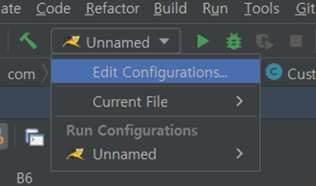

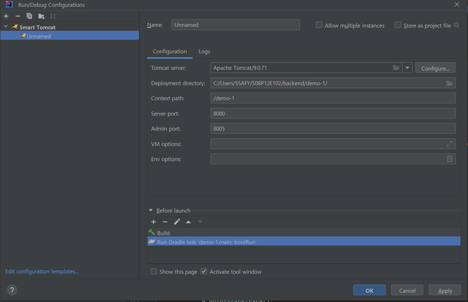

- Application.properties 설정

```spring
_schema \uBD80\uBD84 -> db \uC2A4\uD0A4\uB9C8
spring.datasource.driver-class-name=com.mysql.cj.jdbc.Driver
spring.datasource.url=jdbc:mysql://3.36.76.227:3306/rideway?useUniCode=yes&characterEncoding=UTF-8&serverTimezone=Asia/Seoul

#spring.datasource.url=jdbc:mysql://172.26.6.80:3306/rideway?useUniCode=yes&characterEncoding=UTF-8&serverTimezone=Asia/Seoul


# mysql \uACC4\uC815 id & \uBE44\uBC00\uBC88\uD638 \uC785\uB825
spring.datasource.username=B6
spring.datasource.password=!wlgk6cmd!


#spring.datasource.username=B6
#spring.datasource.password=!wlgk6cmd!

# JPA Settings
spring.jpa.hibernate.ddl-auto=update
spring.jpa.generate-ddl=false
spring.jpa.show-sql=true
spring.jpa.database=mysql
spring.jpa.database-platform=org.hibernate.dialect.MySQL5InnoDBDialect
spring.jpa.properties.hibernate.format_sql=true
spring.jpa.properties.hibernate.show_sql=false
logging.level.org.hibernate.SQL=debug
logging.level.org.hibernate.type=trace

# hibernate loggin
#loggin.level.org.hibernate=info

# email \uC804\uC1A1 \uAD00\uB828
spring.mail.host=smtp.naver.com
spring.mail.port=465
spring.mail.username=ridingmaster01@naver.com
spring.mail.password=1q2w3e4r!
spring.mail.properties.debug=true
spring.mail.properties.mail.smtp.auth=true
spring.mail.properties.mail.smtp.ssl.enable= true
spring.mail.properties.mail.smtp.starttls.enable=true
spring.mail.properties.mail.smtp.ssl.trust=smtp.naver.com


spring.mvc.view.prefix=/WEB-INF/views/
spring.mvc.view.suffix=.jsp

# 웹소켓 개발용
spring.devtools.livereload.enabled=true
spring.devtools.restart.enabled=false

# log4j
logging.config=classpath:log4j2.xml


#Multipart file
spring.servlet.multipart.enabled=true
spring.servlet.multipart.max-file-size=200MB
spring.servlet.multipart.max-request-size=215MB


# https \uC124\uC815

```


- `Nginx`  설정
  - `Letsencrypt`로 `https`적용
  - `443`포트로 리다이렉트 설정
  - `location`에서 `/api`를 통해 백엔드와 프런트 사용 영역을 구분
  - `stomp`연결을 위해 `nginx` 에서 `upgrade` 설정 진행

```nginx
server {
        if ($host = i8e102.p.ssafy.io) {
                return 301 https://$host$request_uri;
        }
                listen 80;
                listen [::]:80;
        server_name i8e102.p.ssafy.io;
        return 404;
}

server {
        listen 443 ssl;
        listen [::]:443 ssl;
        server_name  i8e102.p.ssafy.io;

    ssl_certificate /etc/letsencrypt/live/i8e102.p.ssafy.io/fullchain.pem; # managed by Certbot
    ssl_certificate_key /etc/letsencrypt/live/i8e102.p.ssafy.io/privkey.pem; # managed by Certbot

        access_log      /home/ubuntu/nginx/avilaccess.log;
        error_log       /home/ubuntu/nginx/availerror.log;

        client_max_body_size 100M;

   root /home/ubuntu/jenkins/build/;
        index index.html index.htm;
        server_name i8e102.p.ssafy.io;

        location / {
                try_files $uri $uri/ /index.html;
        }

        location /api/ws-stomp {
                proxy_pass http://localhost:8080;
                proxy_http_version 1.1;
                proxy_set_header Upgrade $http_upgrade;
                proxy_set_header Connection "Upgrade";
                proxy_set_header Host $http_host;
        }


        location /api {
                proxy_set_header X-Real-IP $remote_addr;
                proxy_set_header X-Forwarded-For $proxy_add_x_forwarded_for;
                proxy_set_header Host $http_host;
                proxy_pass http://localhost:8080;

        }

```

- `ufw`를 통한 방화벽 설정
  - `openvidu`설정으로 인해 많은 포트 개방
  - `jenkins` : 9090, `Mysql`: 3306, `Https`: 443, `Http`: 80, `Front`: 8080, `ubuntu`: 22

```linux
Status: active

To                         Action      From
--                         ------      ----
22                         ALLOW       Anywhere
80                         ALLOW       Anywhere
443                        ALLOW       Anywhere
Nginx HTTP                 ALLOW       Anywhere
8080                       ALLOW       Anywhere
9090                       ALLOW       Anywhere
OpenSSH                    ALLOW       Anywhere
3306                       ALLOW       Anywhere
4443                       ALLOW       Anywhere
5000                       ALLOW       Anywhere
8443                       ALLOW       Anywhere
3478                       ALLOW       Anywhere
5442                       ALLOW       Anywhere
5443                       ALLOW       Anywhere
6379                       ALLOW       Anywhere
8888                       ALLOW       Anywhere
3478/udp                   ALLOW       Anywhere
40000:57000/tcp            ALLOW       Anywhere
40000:57000/udp            ALLOW       Anywhere
57001:65535/tcp            ALLOW       Anywhere
57001:65535/udp            ALLOW       Anywhere
3478/tcp                   ALLOW       Anywhere
8443/tcp                   ALLOW       Anywhere
8443/udp                   ALLOW       Anywhere
5443/tcp                   ALLOW       Anywhere
5443/udp                   ALLOW       Anywhere
8442/tcp                   ALLOW       Anywhere
8442/udp                   ALLOW       Anywhere
22 (v6)                    ALLOW       Anywhere (v6)
80 (v6)                    ALLOW       Anywhere (v6)
443 (v6)                   ALLOW       Anywhere (v6)
Nginx HTTP (v6)            ALLOW       Anywhere (v6)
8080 (v6)                  ALLOW       Anywhere (v6)
9090 (v6)                  ALLOW       Anywhere (v6)
OpenSSH (v6)               ALLOW       Anywhere (v6)
3306 (v6)                  ALLOW       Anywhere (v6)
4443 (v6)                  ALLOW       Anywhere (v6)
5000 (v6)                  ALLOW       Anywhere (v6)
8443 (v6)                  ALLOW       Anywhere (v6)
3478 (v6)                  ALLOW       Anywhere (v6)
5442 (v6)                  ALLOW       Anywhere (v6)
5443 (v6)                  ALLOW       Anywhere (v6)
6379 (v6)                  ALLOW       Anywhere (v6)
8888 (v6)                  ALLOW       Anywhere (v6)
3478/udp (v6)              ALLOW       Anywhere (v6)
40000:57000/tcp (v6)       ALLOW       Anywhere (v6)
40000:57000/udp (v6)       ALLOW       Anywhere (v6)
57001:65535/tcp (v6)       ALLOW       Anywhere (v6)
57001:65535/udp (v6)       ALLOW       Anywhere (v6)
3478/tcp (v6)              ALLOW       Anywhere (v6)
8443/tcp (v6)              ALLOW       Anywhere (v6)
8443/udp (v6)              ALLOW       Anywhere (v6)
5443/tcp (v6)              ALLOW       Anywhere (v6)
5443/udp (v6)              ALLOW       Anywhere (v6)
8442/tcp (v6)              ALLOW       Anywhere (v6)
8442/udp (v6)              ALLOW       Anywhere (v6)
```

- 현재 가동중인 프로세스
  - `openvidu`, `jenkins`, `http`, `spring boot`, `mysql`이 계속해서 값을 대기하거나 실행 중이다.

```
Proto Recv-Q Send-Q Local Address           Foreign Address         State       PID/Program name
tcp        0      0 localhost:33060         0.0.0.0:*               LISTEN      899/mysqld
tcp        0      0 0.0.0.0:mysql           0.0.0.0:*               LISTEN      899/mysqld
tcp        0      0 0.0.0.0:http            0.0.0.0:*               LISTEN      1663595/nginx: mast
tcp        0      0 localhost:domain        0.0.0.0:*               LISTEN      561/systemd-resolve
tcp        0      0 0.0.0.0:3478            0.0.0.0:*               LISTEN      1589387/docker-prox
tcp        0      0 0.0.0.0:ssh             0.0.0.0:*               LISTEN      830/sshd: /usr/sbin
tcp        0      0 localhost:6010          0.0.0.0:*               LISTEN      1931454/sshd: ubunt
tcp        0      0 0.0.0.0:8442            0.0.0.0:*               LISTEN      1589801/nginx: mast
tcp        0      0 0.0.0.0:https           0.0.0.0:*               LISTEN      1663595/nginx: mast
tcp        0      0 0.0.0.0:8443            0.0.0.0:*               LISTEN      1589801/nginx: mast
tcp6       0      0 [::]:5442               [::]:*                  LISTEN      1589475/node
tcp6       0      0 [::]:9090               [::]:*                  LISTEN      722385/java
tcp6       0      0 [::]:5443               [::]:*                  LISTEN      1589583/java
tcp6       0      0 [::]:http-alt           [::]:*                  LISTEN      1930945/java
tcp6       0      0 [::]:http               [::]:*                  LISTEN      1663595/nginx: mast
tcp6       0      0 [::]:3478               [::]:*                  LISTEN      1589394/docker-prox
tcp6       0      0 [::]:ssh                [::]:*                  LISTEN      830/sshd: /usr/sbin
tcp6       0      0 [::]:8888               [::]:*                  LISTEN      1589462/kurento-med
tcp6       0      0 ip6-localhost:6010      [::]:*                  LISTEN      1931454/sshd: ubunt
tcp6       0      0 [::]:8442               [::]:*                  LISTEN      1589801/nginx: mast
tcp6       0      0 [::]:https              [::]:*                  LISTEN      1663595/nginx: mast
tcp6       0      0 [::]:8443               [::]:*                  LISTEN      1589801/nginx: mast
udp        0      0 localhost:domain        0.0.0.0:*                           561/systemd-resolve
udp        0      0 ip-172-26-6-80.a:bootpc 0.0.0.0:*                           559/systemd-network
udp        0      0 0.0.0.0:3478            0.0.0.0:*                           1589448/docker-prox
udp6       0      0 [::]:3478               [::]:*                              1589460/docker-prox

```

- Jenkins 설정
  - `GitLab`과 연동시켜, `push`와 `merge` 발생 시 자동 빌드를 하게 된다.

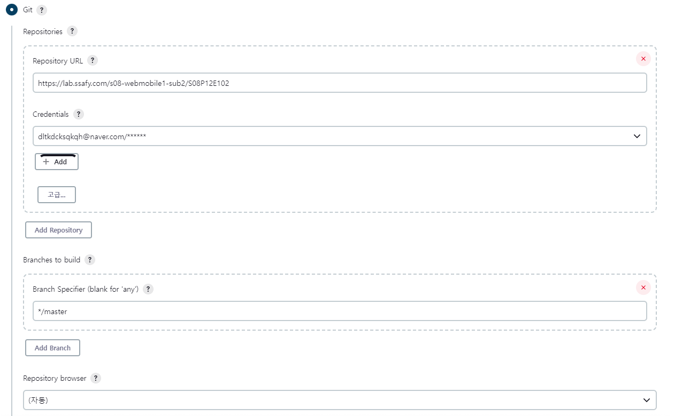

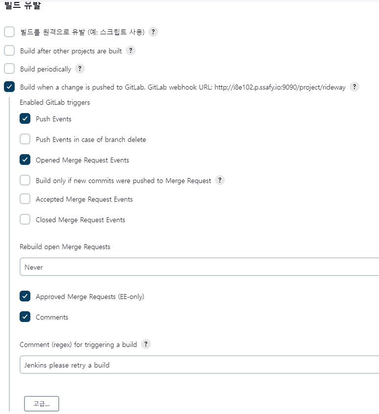

- 젠킨스 플러그인 설치
  - Publish Over SSH
    - 서버에 빌드 파일을 옮겨 주는 플러그인
  - Post build task
    - 빌드 후 조치를 세팅하기 위한 플러그인
  - Generic Webhook Trigger Plugin
    - Gitlab Webhook을 활용하기 위한 plugin
  - GitLab Plugin

- 배포 하기
- 빌드 설정
  - `env`파일로 `kakao map api key`를 복사해서 `front`에 복사해준다.

- 빌드된 파일을 지우고 frontend 빌드를 진행한다.
- backend도 마찬가지로 기존의 빌드된 파일들을 지우고 빌드를 진행한다.
  - 여기서는 gradle을 사용하였다.

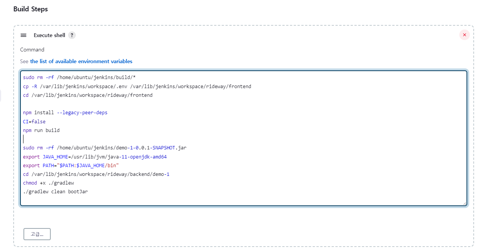

```jenkins
sudo rm -rf /home/ubuntu/jenkins/build/*
cp -R /var/lib/jenkins/workspace/.env /var/lib/jenkins/workspace/rideway/frontend
cd /var/lib/jenkins/workspace/rideway/frontend

npm install --legacy-peer-deps
CI=false
npm run build

sudo rm -rf /home/ubuntu/jenkins/demo-1-0.0.1-SNAPSHOT.jar
export JAVA_HOME=/usr/lib/jvm/java-11-openjdk-amd64
export PATH="$PATH:$JAVA_HOME/bin"
cd /var/lib/jenkins/workspace/rideway/backend/demo-1
chmod +x ./gradlew
./gradlew clean bootJar
```

- 빌드 후 조치
  - 백엔드의 경우 기존에 nohup으로 진행되던 프로세스들을 모두 정리하고 새롭게 빌드된 파일을 실행시켜야 한다.

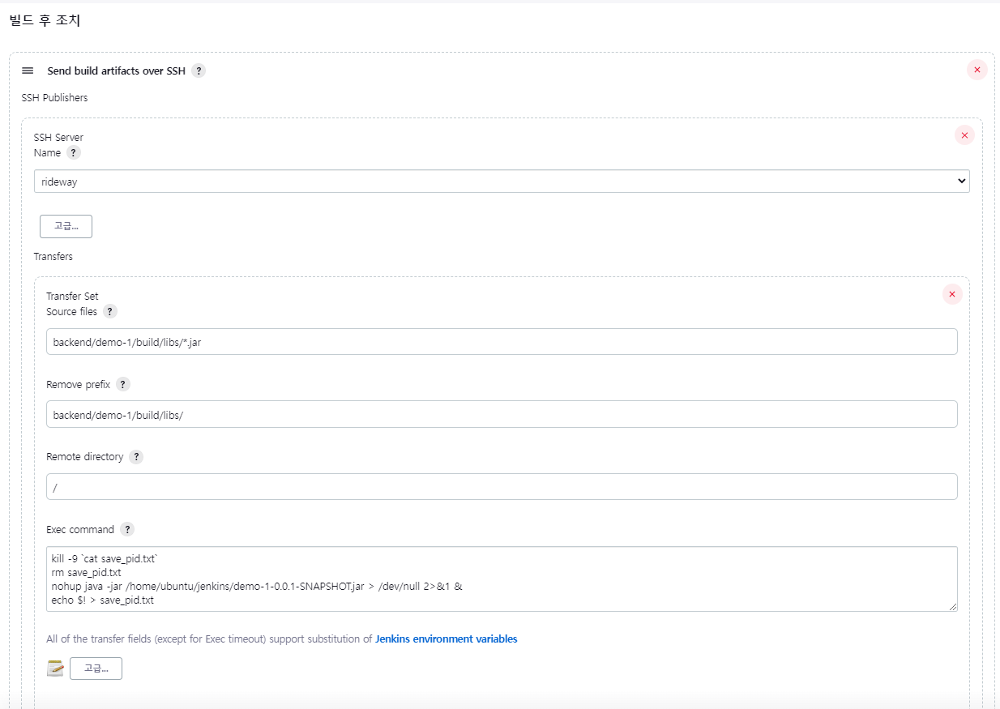

```
kill -9 `cat save_pid.txt`
rm save_pid.txt
nohup java -jar /home/ubuntu/jenkins/demo-1-0.0.1-SNAPSHOT.jar > /dev/null 2>&1 &
echo $! > save_pid.txt
```

- 단순히 빌드된 파일 이동

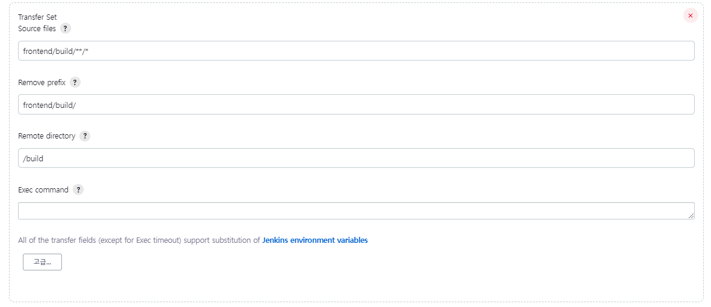


- 앱은 배포할 시간이 부족해서 로컬에서 실행

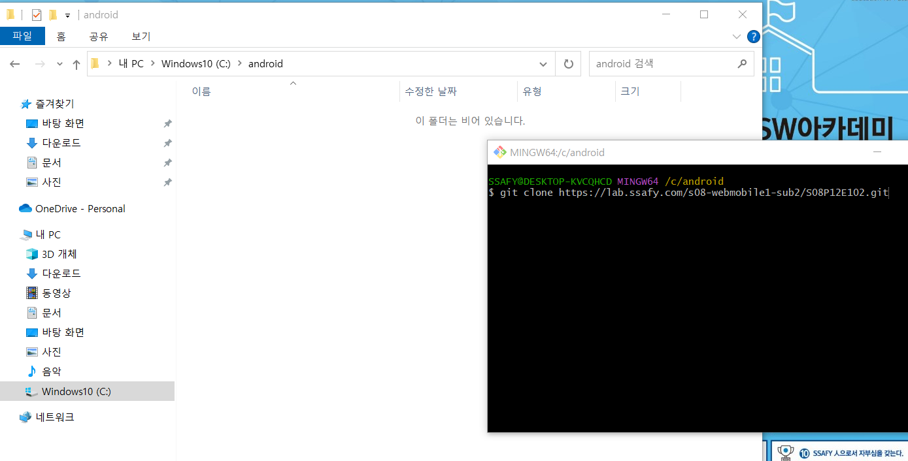

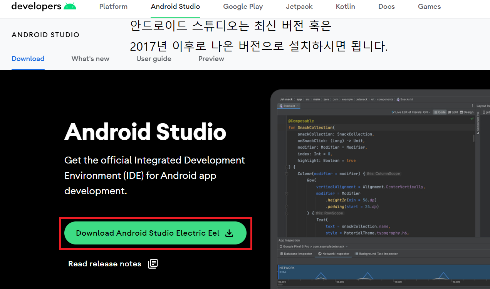

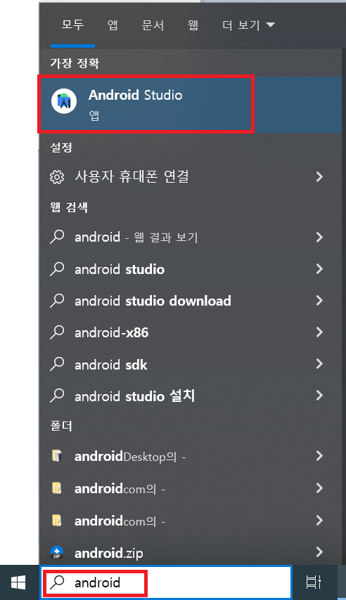


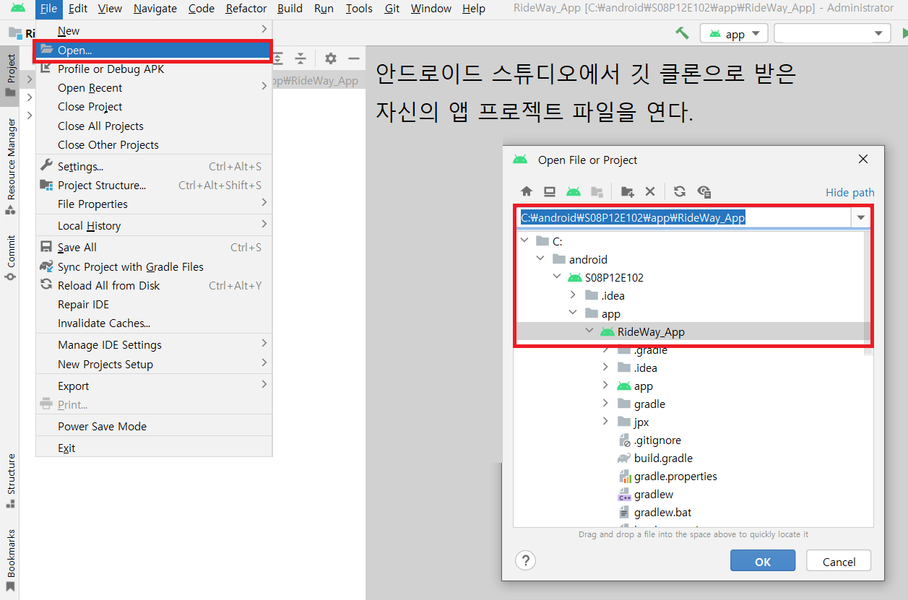

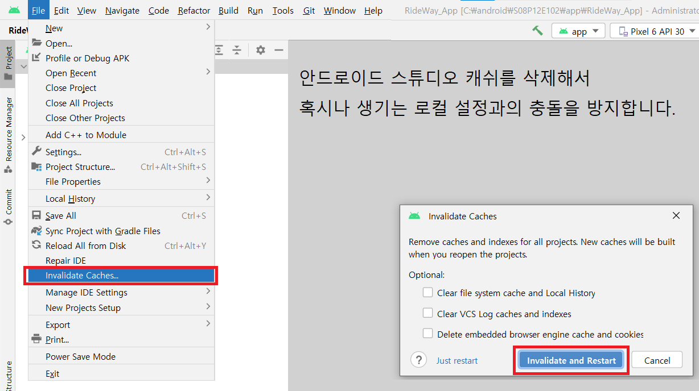

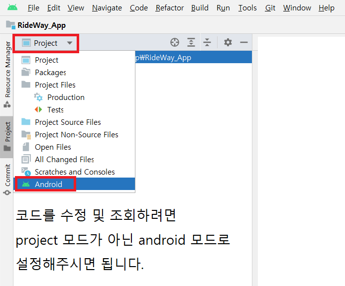

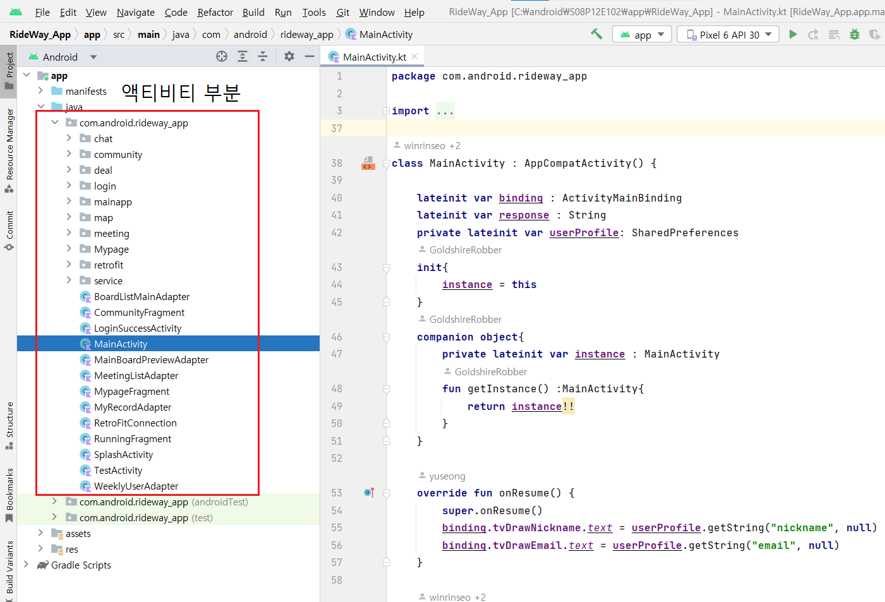

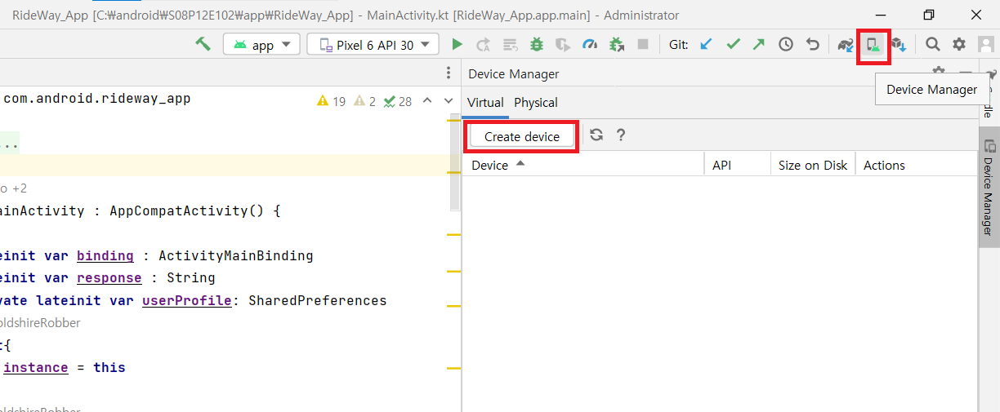

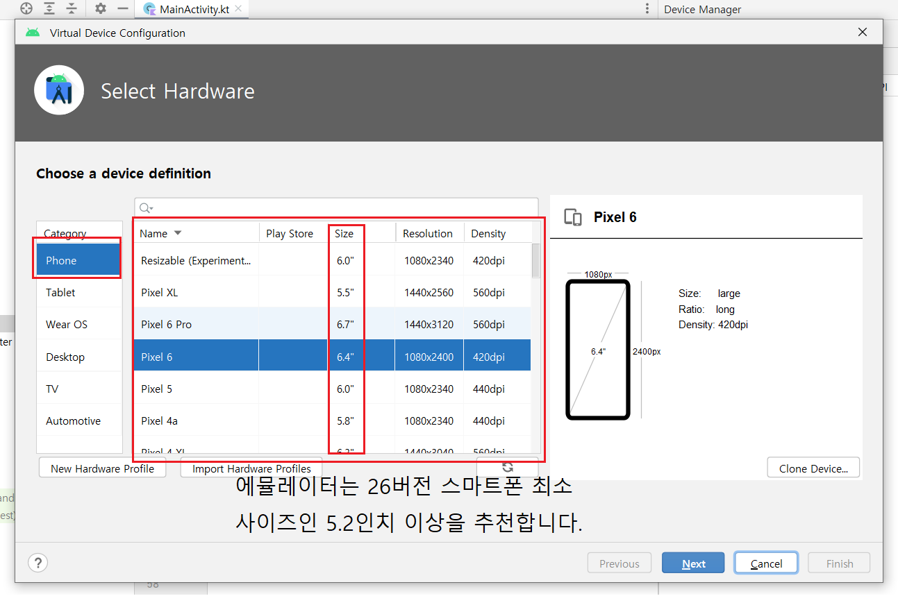

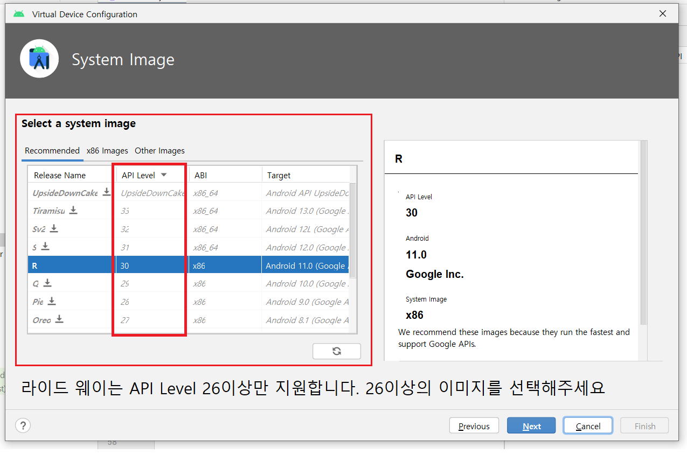

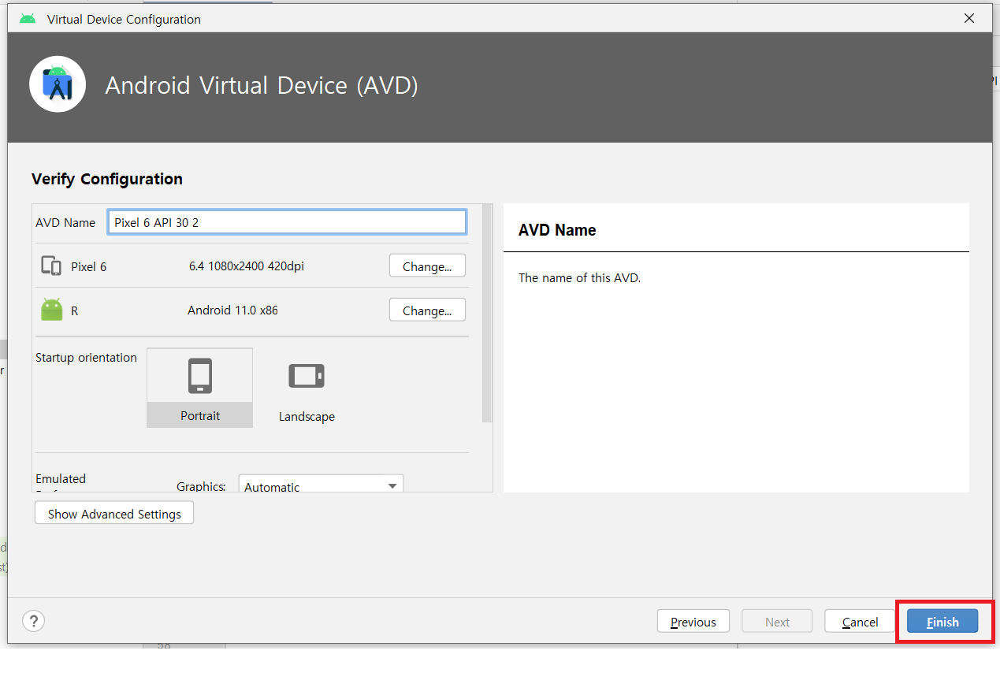


