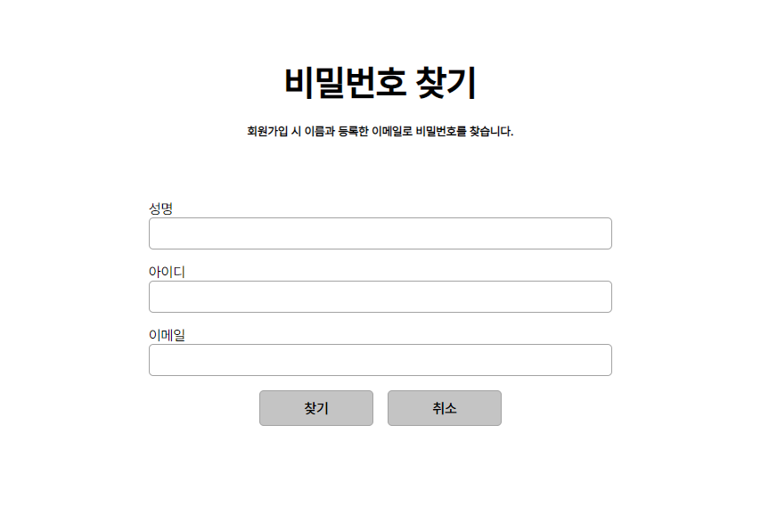
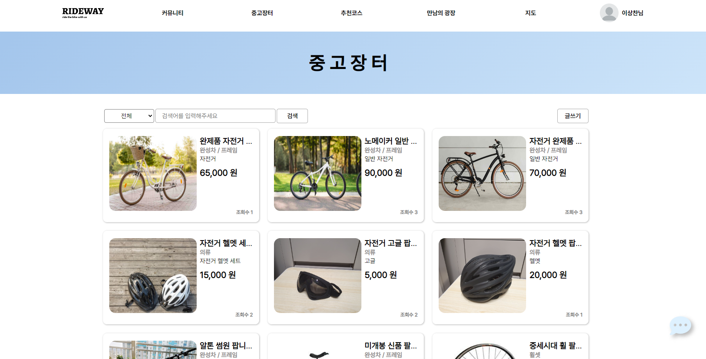
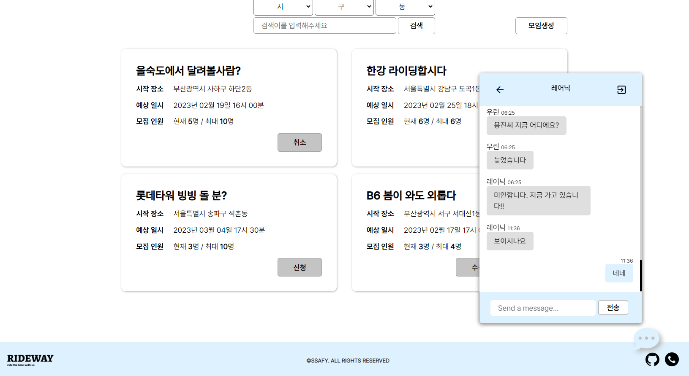

### 📢 시연

#### 1. 웹 구현

- 메인
  - 네브바는 커뮤니티, 중고장터, 추천코스, 만남의 광장, 지도, 프로필로 구성된다.
    - 이때 내 닉네임을 누르면 드랍다운 형태로 마이페이지, 프로필 수정, 비밀번호 변경, 유저 검색, 로그아웃이 표시된다.
  - 누적 거리, 라이딩 시간, 칼로리양에 대한 1, 2, 3등 순위가 보여진다(일주일 단위)
  - 최근 중고 거래 게시글이 케로셀 형태로 제공
  - 자유게시판과 질문게시판이 최근 게시물을 기준으로 표시된다.

- 로그인 창
  - 아이디 찾기, 비밀번호 찾기, 회원가입 기능도 함께 포함하고 있다.

- 처음 등록했던 이메일로 **임시 비밀번호가** 전송된다.

- 아이디는 뒤에 4글자를 제외하고 보여준다. (ex: `dltkdcks****` )

- 회원가입
  - 이메일 인증 시 해당 메일로 인증번호 6글자가 전송된다.
  - 아이디와 닉네임에 대한 중복검사가 진행된다.
  - 정보 공개 여부를 선택하여 생년월일과 이메일등을 모두 숨길 수 있다.

- 회원 정보 수정
  - 회원 정보 수정에서는 프로필 이미지 및 다른 내용들도 수정이 가능하다

- 비밀번호 변경
  - 비밀번호를 자유롭게 변경할 수 있으며, SHA256을 통해 암호화 시켜 DB에 저장된다.

- 마이 페이지
  - 1대 1 화상채팅 기능 제공
  - 작성한 게시글, 찜한 중고 거래 목록, 판매 목록을 모두 확인할 수 있다.
  - 이외에도 운동기록, 모임 일정을 확인할 수 있는 기능을 제공한다.

- 칼로리, 운동 거리, 평균 속도, 운동 시간에 대한 정보 제공

- 일정에서는 달력이 표시되고, 각각의 점은 모임을 **등록한 날짜**를 보여준다.

- 해당 날짜 클릭 시 다음과 같이 **모임 방의 정보**를 확인할 수 있는 모달창이 뜬다.

- 유저 검색
  - 유저를 검색하고 클릭 시 프로필로 이동이 가능하다.

- 커뮤니티
  - 페이지네이션으로 게시물이 10개씩 보여진다
  - 검색을 통해 원하는 게시물 검색이 가능하다.
  - 최신 글 순으로 제공된다.
  - 글 작성 가능

- 디테일에는 조회수, 좋아요 수, 제목, 내용, 좋아요, 수정, 삭제, 댓글 입력 등이 보인다.

- 글 작성은 Toast UI로 구성되어 있다.
  - 이미지 또한 자유롭게 입력이 가능

- 댓글은 프로필 이미지, 날짜, 수정, 삭제등과 함께 표시된다.

- 중고 장터
  - 인피니티 스크롤링으로 구현되어 있다.
  - 제목, 가격, 구성품 종류, 조회수로 내용이 구성되어 있다.
  - 글작성 또한 가능하다
  - 필터링을 적용할 수 있고, 제목을 통해 내용 검색도 가능하다.

- 중고 장터에서 상품에 대한 내용이 보여지고, 하트를 눌러서 상품에 대한 찜이 가능하다

- 중고 거래 내에서 화상채팅 또한 클릭 시 사용 가능하다.

- 글 작성은 구성품 종류, 판매 물건, 판매 가격으로 정해져있다.

- 추천 코스
  - 글 작성 및 검색이 가능하다
  - 페이지네이션으로 구성되어 있으며 10개의 게시글로 구성되었다.

- 추천 코스는 아래와 같이 경로를 확인할 수 있다.
  - 경로 저장 및 경로 삭제를 통해 내가 원하는 경로를 리스트로 모아 볼 수 있다.

- 추천 경로 작성에서 GPX 파일을 넣으면 미리보기를 통해 경로를 확인할 수 있다.
  - 해당 경로 파일에 대한 이름 설정 가능하다.

- 만남의 광장
  - 모임 생성이 가능하며 지역에 따라 검색이 가능하다.

- 상세 내용 확인 시 채팅방 입장, 유저에 대한 목록, 강퇴, 초대 기능이 구비되어 있다.

- 지도
  - 저장한 경로를 오른쪽 리스트 클릭으로 바로 확인이 가능하다

- 왼쪽 아래와 위쪽 그림들을 눌러서 자전거 도로, 지형 정보, 주변 상권 정보 등을 확인할 수 있다.

- 채팅
  - 알림 기능이 존재한다
  - 소켓을 통해 실시간 채팅이 가능하다.

- 화상 통화
  - 마이크, 음소거, 나가기 기능이 있다.
  - 마이 페이지에서 1대1 채팅, 중고거래에서 채팅이 가능하다.

### 2. 앱 구현

- 시작 페이지
  - 로그인, 회원가입, 아이디 찾기, 패스워드 찾기 기능 존재

- 로그인 기능

- 메인 페이지
  - 만남의 광장, 기록 순위, 게시판이 대표적 표시

- 마이페이지 기능
  - 프로필 열람, 채팅, 판매 기록 등을 열람할 수 있다.

- 프로필 설정
  - 프로필 수정, 이메일 수정, 비밀번호 변경, 회원탈퇴, 로그아웃을 할 수 있다.

- 프로필 수정

- 이메일 수정

- 비밀번호 수정

- 회원탈퇴

- 로그아웃 기능

- 비밀번호 찾기(초기화)

- 아이디 찾기

- 회원가입
  - 이메일 인증, 아이디 중복 확인

- 자유게시판
  - 글 작성, 검색이 가능

- 경로 게시판
  - 댓글 작성, 하트를 눌러서 경로 저장이 가능

- 실시간 주행 기록
  - 왼쪽 위 탭을 통해 자전거 도로와 자전거 인증센터 위치를 확인할 수 있다.
  - 저장된 코스를 가져와서 표시가 가능
  - 주행 기록 시작 시 칼로리, 속도, 이동 거리, 이동 시간이 표시된다.

